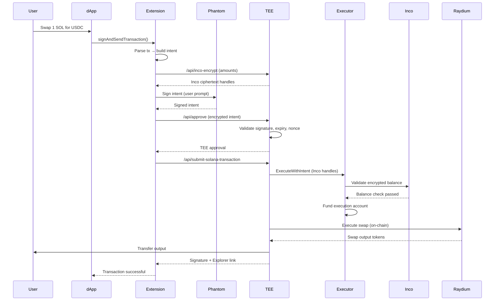

# VØID — Privacy Layer for Solana

[](LICENSE)
[](https://solana.com)
[](https://github.com)

VØID is a **privacy-first execution layer** for Solana that enables confidential transactions through intent-based architecture. Users sign intents (not raw transactions), sensitive data is encrypted with **Inco Lightning** before leaving the client, and execution is coordinated by a **TEE server** with **MagicBlock PER** integration for high-performance private settlement.

Think of it as a **VPN for Web3 transactions** — your wallet activity becomes private by default, with on-chain enforcement guarantees powered by fully homomorphic encryption (FHE).

---

## 🎯 Why VØID Matters

**The Problem:**
- All Solana transactions are public: amounts, recipients, and wallet activity are visible on-chain
- MEV bots can front-run large swaps, causing slippage and value extraction
- Privacy requires complex tooling that breaks dApp compatibility
- Users must trust off-chain operators without verifiable guarantees

**The Solution:**
- ✅ **Confidential by default** — amounts and intent parameters encrypted before RPC transmission
- ✅ **On-chain enforcement** — encrypted arithmetic validates rules using Inco FHE, not trust
- ✅ **Zero dApp changes** — standard wallet APIs intercepted transparently
- ✅ **Composable infrastructure** — works with any RPC, rollup, or privacy SDK
- ✅ **MEV protection** — transactions executed through TEE prevent front-running

---

## 🏗️ Architecture

VØID consists of three layers that work together to provide privacy-preserving transaction execution:

### **1. Client Layer (Browser Extension)**
The extension runs in the user's browser and handles transaction interception and encryption:

```
┌─────────────────────────────────────────────────────────┐
│  Browser Extension                                       │
│  ┌────────────────┐  ┌──────────────┐  ┌─────────────┐ │
│  │   content.js   │→ │background.js │→ │  Encryption │ │
│  │  (Interceptor) │  │ (Orchestrator│  │   Module    │ │
│  └────────────────┘  └──────────────┘  └─────────────┘ │
│         ↓                    ↓                  ↓        │
│  Phantom Wallet      Intent Builder      Inco SDK       │
└─────────────────────────────────────────────────────────┘
```

**Key Components:**
- **`content.js`** — Injects interceptor scripts into web pages at `document_start`
- **`solana-transaction-interceptor.js`** — Wraps Phantom wallet API calls
- **`background.js`** — Service worker that orchestrates the entire flow:
  - Extracts transaction amounts and builds intents
  - Encrypts sensitive fields using Inco SDK
  - Manages user signatures via Phantom
  - Coordinates with TEE server
- **`solana-intent-builder.js`** — Converts raw transactions into structured intents
- **`encryption.js`** — Client-side encryption wrapper for Inco ciphertext handles
- **`phantom-signer.js`** — Handles user signatures in page context

**Flow:**
1. dApp calls `wallet.signAndSendTransaction()`
2. Extension intercepts before Phantom sees it
3. Transaction parsed → intent created → sensitive fields encrypted
4. User signs intent (not raw transaction) via Phantom popup
5. Encrypted intent sent to TEE server

---

### **2. TEE Server Layer**
Node.js server simulating TEE behavior with modular architecture:

```
┌──────────────────────────────────────────────────────────┐
│  TEE Server (Node.js)                                     │
│  ┌────────────┐  ┌─────────────┐  ┌──────────────────┐  │
│  │ server.js  │→ │  Intent     │→ │ Swap Executor    │  │
│  │ (API)      │  │  Validator  │  │ (Raydium)        │  │
│  └────────────┘  └─────────────┘  └──────────────────┘  │
│         ↓              ↓                    ↓             │
│   Rate Limit    Inco Handles       MagicBlock PER        │
└──────────────────────────────────────────────────────────┘
```

**Key Modules (`server/modules/`):**
- **`intent.js`** — Validates expiry, nonce (replay protection), Inco handles
- **`signature.js`** — Verifies Solana Ed25519 signatures
- **`swap-executor.js`** — Executes Raydium swaps on behalf of users
- **`raydium-v2.js`** — Builds swap instructions using Raydium SDK
- **`magicblock.js`** — Integrates MagicBlock PER for fast private execution
- **`tee.js`** — TEE attestation and encryption key management
- **`transaction.js`** — Submits transactions and confirms on-chain

**Endpoints:**
- `POST /api/approve` — Validates intent and returns TEE approval
- `POST /api/submit-solana-transaction` — Executes swap via executor program
- `POST /api/inco-encrypt` — Dev proxy for Inco encryption (client-side in prod)
- `GET /api/status` — Server health, executor program ID, MagicBlock status

**Security Features:**
- Rate limiting (30 req/min per IP)
- Nonce-based replay protection
- Intent expiry validation (5 min default)
- Signature verification (Ed25519)

---

### **3. On-Chain Layer (Executor Program)**
Native Solana program (Rust) that holds user vaults and enforces rules using Inco Lightning FHE:

```
┌────────────────────────────────────────────────────────┐
│  Executor Program (Rust)                                │
│  ┌──────────┐  ┌───────────┐  ┌──────────────────┐    │
│  │ Deposit  │→ │  Withdraw │→ │ Execute w/Intent │    │
│  │ (Inco)   │  │  (Inco)   │  │ (Inco + Raydium) │    │
│  └──────────┘  └───────────┘  └──────────────────┘    │
│       ↓              ↓                  ↓               │
│  User PDA      Vault PDA       Inco Lightning CPIs     │
└────────────────────────────────────────────────────────┘
```

**Program Structure (`server/programs/anonymaus-executor/src/lib.rs`):**
- **Native Solana** (no Anchor) for maximum control and transparency
- **PDAs (Program Derived Addresses):**
  - `executor` — Global state (authority, vault, nonce)
  - `vault` — Holds pooled SOL for gas fees
  - `user_deposit` — Per-user encrypted balance

**Instructions:**
1. **`Initialize`** — Sets up executor state with authority and vault
2. **`Deposit`** — User deposits SOL, stores encrypted balance via Inco
   - Calls `inco_new_euint128()` to create ciphertext handle
   - Stores handle in `user_deposit` PDA
3. **`Withdraw`** — Validates encrypted balance ≥ amount using Inco FHE
   - Calls `inco_e_ge()` for comparison (no decryption!)
   - Transfers funds if check passes
4. **`ExecuteWithIntent`** — Executes swap after intent validation
   - Verifies intent signature matches user
   - Validates encrypted amount using `inco_e_sub()` and `inco_e_ge()`
   - Funds execution account from vault
   - Server executes Raydium swap
   - Transfers output to user

**Inco Integration:**
The program never decrypts user balances on-chain. All operations use **Fully Homomorphic Encryption (FHE)** via Inco Lightning CPIs:
- `new_euint128` — Create encrypted value from ciphertext
- `as_euint128` — Convert plaintext to encrypted (for constants)
- `e_add` — Encrypted addition
- `e_sub` — Encrypted subtraction
- `e_ge` — Encrypted greater-than-or-equal comparison

---

## 🔄 How It Works (End-to-End Flow)



**Step-by-Step:**
1. **Interception** — Extension captures `signAndSendTransaction()` before Phantom
2. **Intent Creation** — Transaction parsed into intent with metadata (expiry, nonce)
3. **Encryption** — Amounts encrypted using Inco SDK, producing ciphertext handles
4. **User Signature** — Phantom prompts user to sign intent (not raw tx)
5. **TEE Approval** — Server validates intent + signature, returns approval
6. **Deposit Check** — Executor program validates user has sufficient funds (via Inco FHE)
7. **Execution** — TEE server builds and executes swap via Raydium
8. **Output Transfer** — Swap output sent directly to user's wallet
9. **Confirmation** — Transaction signature returned to dApp

---

## 🔐 Privacy & Security Features

### **Privacy Guarantees**
- ✅ Transaction amounts **never visible** to RPC nodes
- ✅ Intent parameters encrypted **before** network transmission
- ✅ On-chain balances stored as **Inco ciphertext** (FHE encrypted)
- ✅ No plaintext amounts in program accounts or logs
- ✅ RPC operators only see encrypted blobs and signatures

### **Security Mechanisms**
- ✅ **Replay protection** — Intent nonces prevent duplicate execution
- ✅ **Time-bound execution** — Intents expire after 5 minutes
- ✅ **Signature verification** — Ed25519 signature validates user authorization
- ✅ **Rate limiting** — 30 requests/min per IP on TEE endpoints
- ✅ **On-chain enforcement** — Rules validated using FHE, not trust
- ✅ **Slippage protection** — User-defined max slippage enforced

### **What's NOT Private (by design)**
- Public key (wallet address) — Required for on-chain execution
- Transaction signature — Needed for Solana consensus
- Raydium pool interactions — Public pool state changes
- Output token receipt — Final transfer to user wallet

---

## 📦 Repository Structure

```
void_sol/
├── extension/                    # Browser extension (Chrome/Brave)
│   ├── manifest.json            # Extension config (MV3)
│   ├── background.js            # Service worker (orchestration)
│   ├── content.js               # Page injection + message bridge
│   ├── popup.html/js/css        # Extension UI with WebGL effects
│   ├── functions/
│   │   ├── solana-transaction-interceptor.js  # Wraps wallet API
│   │   ├── phantom-signer.js                  # Signature handling
│   │   ├── solana-intent-builder.js           # Intent creation
│   │   ├── encryption.js                      # Inco SDK wrapper
│   │   └── tee-client.js                      # TEE API client
│   └── assets/                   # Icons and images
│
├── server/                       # TEE server + Solana program
│   ├── server.js                # Express API (main entry point)
│   ├── modules/
│   │   ├── intent.js            # Intent validation
│   │   ├── swap-executor.js     # Raydium swap logic
│   │   ├── raydium-v2.js        # Raydium SDK integration
│   │   ├── magicblock.js        # MagicBlock PER integration
│   │   ├── signature.js         # Ed25519 verification
│   │   ├── tee.js               # TEE attestation
│   │   └── logger.js            # Structured logging
│   ├── programs/
│   │   └── anonymaus-executor/  # Native Solana program (Rust)
│   │       ├── src/lib.rs       # Program logic + Inco CPIs
│   │       └── Cargo.toml       # Build config
│   ├── scripts/
│   │   ├── deploy-solana-program.js          # Deploy to devnet
│   │   ├── initialize-solana-program.js      # Initialize executor state
│   │   └── test-magicblock-swap.js           # Integration tests
│   └── package.json             # Dependencies (@solana/web3.js, etc.)
│
├── docs/                         # Comprehensive documentation
│   ├── PROTOCOL_FLOW.md         # End-to-end flow diagram
│   ├── INCO.md                  # Inco integration details
│   ├── MagicBlock.md            # MagicBlock PER usage
│   ├── Quicknode.md             # RPC partner integration
│   └── ROADMAP.md               # Development roadmap
│
└── tests/                        # Test harness + examples
    └── test_inco/               # Inco SDK test suite
```

---

## 🚀 Quick Start (Development)

### Prerequisites
- Node.js 18+ and npm
- Rust + Solana CLI (`1.18+`)
- Chrome/Brave browser
- Phantom wallet extension
- Solana devnet wallet with SOL ([Faucet](https://faucet.solana.com))

### 1. Deploy Executor Program

```bash
cd server
npm install

# Build the Rust program
npm run build-program

# Deploy to devnet (saves program ID to .env)
npm run deploy-program

# Initialize program state
npm run initialize-solana-program
```

This creates:
- Executor PDA (program authority)
- Vault PDA (holds pooled SOL)
- Sets your wallet as program authority

### 2. Start TEE Server

```bash
# In server directory
cp .env.example .env
# Edit .env and set:
#   SOLANA_EXECUTOR_PROGRAM_ID=<from deployment>
#   SOLANA_EXECUTION_SECRET_KEY=<base58 keypair>
#   SOLANA_RPC_URL_DEVNET=<your RPC URL>
#   USE_MAGICBLOCK_PER=false  # or true if using PER

npm start
# Server runs on http://localhost:3001
```

### 3. Load Browser Extension

1. Open Chrome → `chrome://extensions/`
2. Enable "Developer mode" (top right)
3. Click "Load unpacked"
4. Select `extension/` folder
5. Extension icon appears in toolbar

### 4. Test the Flow

1. Visit [Raydium Swap UI](https://raydium.io/swap) or any Solana dApp
2. Connect Phantom wallet
3. Enable VØID extension (click icon → "Anonymize")
4. Initiate a swap (e.g., 0.01 SOL → USDC)
5. Extension intercepts → prompts for deposit → prompts for intent signature
6. Swap executes via executor program
7. Check transaction on [Solana Explorer](https://explorer.solana.com/?cluster=devnet)

**Expected Behavior:**
- Extension logs show interception and encryption
- Phantom prompts twice (deposit + intent signature)
- TEE server logs show validation and execution
- On-chain: deposit PDA created, swap executed, output transferred

---

## 🛠️ Configuration

### Server Environment (`.env`)

```bash
# Executor Program
SOLANA_EXECUTOR_PROGRAM_ID=<deployed program ID>
SOLANA_EXECUTION_SECRET_KEY=<base58 keypair>

# RPC URLs (configure your preferred endpoints)
SOLANA_RPC_URL_DEVNET=https://api.devnet.solana.com
SOLANA_RPC_URL_MAINNET=https://api.mainnet-beta.solana.com

# MagicBlock PER (optional)
USE_MAGICBLOCK_PER=false
MAGICBLOCK_EPHEMERAL_RPC=https://devnet.magicblock.app

# Inco Lightning (program ID on devnet)
INCO_LIGHTNING_PROGRAM_ID=5sjEbPiqgZrYwR31ahR6Uk9wf5awoX61YGg7jExQSwaj

# Security (optional)
SKIP_SIGNATURE_VERIFICATION=false  # Set true for testing only
```

### Extension Settings (UI)

- **RPC Strategy:** Default / Public / Custom URL
- **Theme:** Dark / Light mode
- **Logs:** View extension + server console logs

---

## 🧪 Testing

### Unit Tests (Inco Integration)

```bash
cd tests/test_inco
npm install
npm run test:inco  # Tests deposit, withdraw, execute flows
```

### Integration Tests (MagicBlock Swap)

```bash
cd server
npm run test:magicblock-swap  # Full swap via PER
```

### Manual Testing Checklist

- [ ] Extension intercepts Phantom transactions
- [ ] Amounts encrypted before RPC transmission
- [ ] User deposit PDA created on first transaction
- [ ] Intent signature validates correctly
- [ ] Executor program validates encrypted balance
- [ ] Swap executes via Raydium on devnet
- [ ] Output tokens transferred to user wallet

---

## 📚 Documentation

Comprehensive guides in `/docs`:

| Document | Description |
|----------|-------------|
| **[PROTOCOL_FLOW.md](docs/PROTOCOL_FLOW.md)** | End-to-end architecture + sequence diagrams |
| **[INCO.md](docs/INCO.md)** | Inco Lightning integration (FHE on Solana) |
| **[MagicBlock.md](docs/MagicBlock.md)** | MagicBlock PER usage for fast settlement |
| **[Quicknode.md](docs/Quicknode.md)** | RPC partner integration guide |
| **[ROADMAP.md](docs/ROADMAP.md)** | Development phases + milestones |

---

## 🔌 Integration Partners

VØID leverages cutting-edge Solana infrastructure:

### **Inco Lightning** ([docs.inco.org](https://docs.inco.org))
- Fully Homomorphic Encryption (FHE) on Solana
- Enables encrypted arithmetic without decryption
- Used for confidential balance checks and amount validation
- Program ID: `5sjEbPiqgZrYwR31ahR6Uk9wf5awoX61YGg7jExQSwaj`

### **MagicBlock PER** ([magicblock.gg](https://magicblock.gg))
- Private Ephemeral Rollups for real-time execution
- TEE-backed L2 with L1 settlement
- Hybrid mode: PER for custody, L1 for swaps (avoids delegation issues)
- Optional (disable in `.env` if not using)

### **Quicknode** ([quicknode.com](https://quicknode.com))
- RPC infrastructure provider
- Extension supports custom RPC routing
- Partner RPC selection passed end-to-end from client to server

### **Raydium** ([raydium.io](https://raydium.io))
- Automated Market Maker (AMM) for swaps
- SDK integration for swap instruction building
- Devnet pool: SOL/zUSDC (`DKgK88CMJbQDpPWhhkN6j1sMVnXJJvuScubeTBKKNdwL`)

---

## 🏗️ Development Roadmap

### ✅ Phase 1 — Hackathon Launch (Current)
- [x] Working end-to-end flow (deposit → intent → execute)
- [x] Inco-based confidential enforcement
- [x] Live Raydium swap demo on devnet
- [x] Partner RPC selection in extension + server
- [x] Open-source repo with MIT license

### 🚧 Phase 2 — Builder Adoption (Next)
- [ ] SDK + reference integration guide for dApps
- [ ] Threat model documentation (what's private vs. public)
- [ ] Test suite for integration partners
- [ ] Chrome Web Store release
- [ ] Community feedback loop (issues + roadmap)

### 📅 Phase 3 — Pilot Partnerships
- [ ] 1–2 partner dApps on devnet
- [ ] Formalize SLAs for RPC + TEE availability
- [ ] Telemetry + performance dashboards
- [ ] Security review / external audit plan
- [ ] Cross-browser packaging (Safari, Firefox)

### 🎯 Phase 4 — Scale to Mainnet
- [ ] Mainnet pilot with rate limits + allowlist
- [ ] Multi-RPC routing + failover
- [ ] PER delegation support for high-throughput
- [ ] Production runbook + incident response
- [ ] Safari + Firefox extension releases

### 🌐 Phase 5 — Ecosystem Growth
- [ ] Multi-asset privacy vaults
- [ ] Multi-chain expansion (if demand)
- [ ] Grants + ecosystem partnerships
- [ ] Developer marketplace for privacy apps

---

## ⚠️ Status & Disclaimers

**Current Status:** Working prototype for hackathon/development

**Known Limitations:**
- Devnet only (not production-ready)
- Simulated TEE (no real hardware enclave)
- No formal security audit
- Rate limiting is IP-based (can be bypassed)
- Extension requires manual installation (not on Chrome Web Store)

**Security Disclaimers:**
- This code is for **demonstration purposes** and has not been audited
- Do NOT use with real funds or on mainnet without proper security review
- TEE simulation does not provide real hardware guarantees
- Private keys are stored in `.env` files (insecure for production)
- No incident response or SLA guarantees

**Before Production Use:**
- [ ] Security audit by reputable firm
- [ ] Replace simulated TEE with actual Intel SGX or AMD SEV
- [ ] Implement key management system (HSM or KMS)
- [ ] Add comprehensive monitoring and alerting
- [ ] Deploy redundant infrastructure with failover
- [ ] Legal review + terms of service
- [ ] Bug bounty program

---

## 🤝 Contributing

We welcome contributions! Areas where you can help:

- **Security:** Audit code, report vulnerabilities
- **Documentation:** Improve guides, add examples
- **Testing:** Write integration tests, test edge cases
- **Features:** Implement roadmap items, propose improvements
- **UX:** Design better UI/UX for extension
- **Performance:** Optimize swap execution, reduce latency

Please open an issue before starting major work to discuss approach.

---

## 📄 License

MIT License - see [LICENSE](LICENSE) file for details.

---

## 🔗 Links

- **Documentation:** [/docs](docs/)
- **Issues:** GitHub Issues
- **Twitter:** [@VoidProtocol](https://twitter.com/VoidProtocol) (example)
- **Discord:** [Join community](https://discord.gg/void) (example)

---

**Built with ❤️ for the Solana Privacy Hack**
